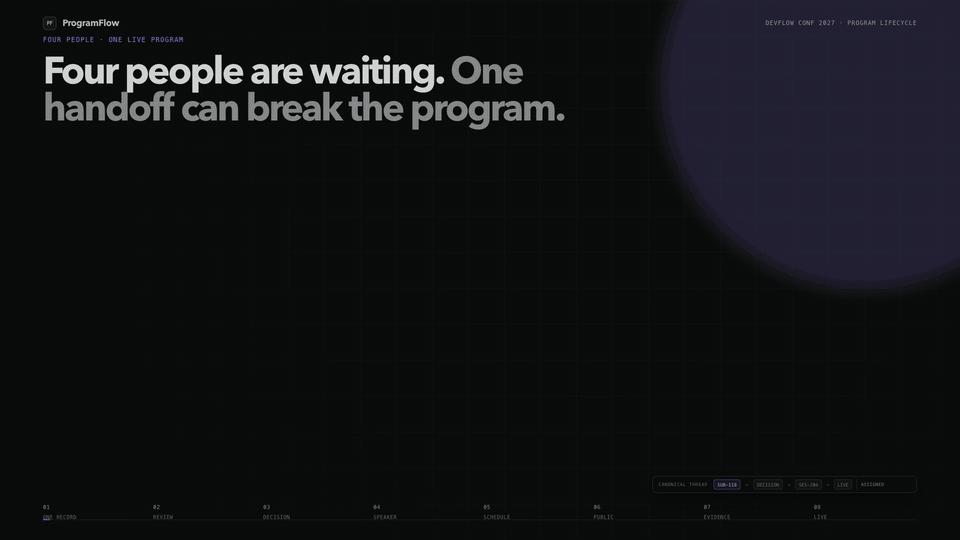
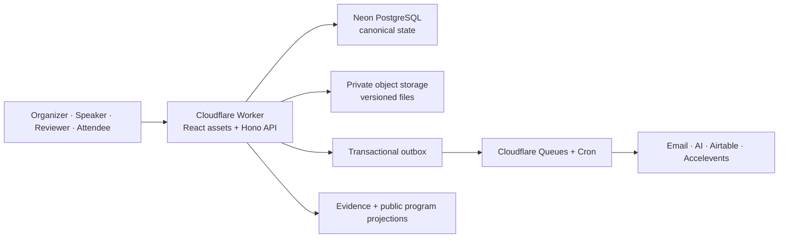

# ProgramFlow

<p align="center">
  <a href="https://programflow-evaluation.programflow.workers.dev/artifacts/four-roles-one-program.mp4">
    
  </a>
</p>

<p align="center"><sub>Animated preview—click it to stream the complete film with sound.</sub></p>

<p align="center"><strong>The conference-program operating system from CFP to published agenda—without re-entering the same data.</strong></p>

<p align="center">
  <a href="https://programflow-evaluation.programflow.workers.dev/"><strong>Open the live product</strong></a>
  · <a href="https://programflow-evaluation.programflow.workers.dev/artifacts/four-roles-one-program.mp4">Watch “Four Roles, One Program” (66 seconds, with audio)</a>
  · <a href="docs/architecture.md">Read the system design</a>
  · <a href="docs/product-spec.md">Read the product specification</a>
</p>

<p align="center">
  <a href="https://github.com/VasuBansal7576/kill-my-saas/actions/workflows/ci.yml"></a>
  
  
  
</p>

ProgramFlow is a production-oriented SaaS for operating a conference program. Organizers configure the event and CFP, speakers submit proposals, reviewers score only their assignments, accepted proposals become linked sessions and speaker work, and a conflict-free schedule becomes the public program.

The important part is not the number of screens. It is the continuity of the data. A `Submission`, `Decision`, `Session`, speaker profile, deliverable, placement, and `Publication` remain distinct records connected by explicit transitions. Each role sees the same underlying program through a deliberately scoped view.

## The product loop

```mermaid
flowchart LR
    CFP["Build and publish CFP"] --> SUB["Draft and submit proposal"]
    SUB --> REV["Assign and complete reviews"]
    REV --> DEC["Record and release decision"]
    DEC --> SES["Create linked session + speaker work"]
    SES --> OPS["Complete onboarding + deliverables"]
    OPS --> SCH["Place sessions + resolve conflicts"]
    SCH --> PUB["Publish one eligible revision"]
    PUB --> WEB["Serve agenda, sessions, speakers + embeds"]
```



No stage maintains its own copy of the conference. Acceptance creates a linked session once; scheduling places that session once; every public surface reads the same eligible program.

## What is implemented

- **Organizer workspace:** event configuration, CFP builder, submissions, multi-round evaluation, decisions, speaker operations, files, communications, agenda, publishing, integrations, evidence, and organization-level Speaker CRM.
- **Speaker portal:** scoped submissions, decisions, profile, assigned sessions, tasks, resources, and versioned deliverables.
- **Reviewer portal:** explicit assignment queues, blind-review identity suppression, scorecards, recusals, and peer-review isolation.
- **Public program:** five anonymous surfaces—sessions, speakers, agenda, itinerary, and gallery—with search, filtering, details, persistence, calendar export, and embed/share formats.
- **Operational side effects:** PostgreSQL outbox, Cloudflare Queues/Cron, provider attempt history, deterministic iCalendar artifacts, file versions, and inspectable integration runs.
- **Evaluator contract:** 98 tracked items across 20 stateful scenarios, including the 12-item Speaker CRM extension. The public scorecard distinguishes implementation coverage from independently verified evidence.

## Architecture at a glance



ProgramFlow is a modular monolith: one deployable Worker, one authoritative relational model, and independently owned domain modules. Routes do not write tables directly. Cross-domain transitions happen through module interfaces inside a transaction or through an outbox event after commit.

Read [the complete system design](docs/architecture.md) for module ownership, state authority, failure handling, authorization, publication consistency, and deployment topology.

## Correctness is structural

| Invariant | How the code enforces it |
|---|---|
| A proposal never silently becomes a session | Acceptance creates a distinct linked `Session` in one idempotent transaction. |
| One decision owns the outcome | Accepted/rejected UI labels are projections of `Decision`, not competing status fields. |
| One publication owns public visibility | Scheduling reports readiness; only Publishing can move the event live or paused. |
| Reviewers see only authorized work | Assignment, round, blind-review, and reviewer-person predicates are enforced server-side. |
| Side effects cannot disappear after commit | The business transition and its outbox record commit together; workers retry idempotently. |
| Public widgets cannot drift | All five surfaces serialize one eligible published-program query. |
| Files are never overwritten | Each upload becomes an immutable version with authorization-aware access. |

## Repository map

```text
apps/web/                 React workspaces, route UX, public surfaces
apps/worker/              Hono API, authorization, queues, cron, domain modules
packages/contracts/       Shared validation and API contracts
packages/database/        Drizzle schema, migrations, database tooling
packages/testkit/         Deterministic evaluator fixtures and test helpers
docs/requirements/        Live contract and per-item evidence ledger
docs/runbooks/            Evaluation preparation and operator procedures
tests/integration/        Cross-module persisted lifecycle tests
public/artifacts/         Approved launch film
```

The detailed navigation guide is in [docs/README.md](docs/README.md). Coding agents should start with [AGENTS.md](AGENTS.md); human contributors should start with [CONTRIBUTING.md](CONTRIBUTING.md).

## Run it locally

Requirements: Node.js 24+, npm 11+, and PostgreSQL 17 for database-backed suites.

```bash
npm ci
cp .env.example .env
npm run db:migrate
npm run dev
```

Run the same quality gate used in CI:

```bash
npm run check
```

The gate runs strict TypeScript, ESLint, Vitest, the production build, and Cloudflare evaluation/production deployment dry-runs. The latest green CI run executes **74 test files / 247 tests**, including database-backed authorization and lifecycle suites.

## Prepare a clean evaluation environment

Evaluation reset is intentionally explicit and unavailable in production. Use a disposable evaluation database, supply the documented confirmation variables, then run:

```bash
npm run prepare:evaluation
```

This performs the controlled order:

1. validate and reset only the named evaluation scope;
2. apply all migrations from empty;
3. seed the deterministic event and canonical aliases;
4. synchronize organizer, both speakers, and reviewer identities.

See [the evaluation environment runbook](docs/runbooks/evaluation-environment.md) and [the release/evidence runbook](docs/runbooks/evaluation.md) before running it. Never point these commands at production.

## Verification

Claims stay auditable through the [V1 contract ledger](docs/requirements/v1-ledger.json), [system design](docs/architecture.md), and [green CI gate](https://github.com/VasuBansal7576/kill-my-saas/actions). Security assumptions and responsible-disclosure guidance live in [SECURITY.md](SECURITY.md).

---

ProgramFlow is designed around one promise: **enter program data once, then move it through real work without losing provenance, privacy, or operational evidence.**
