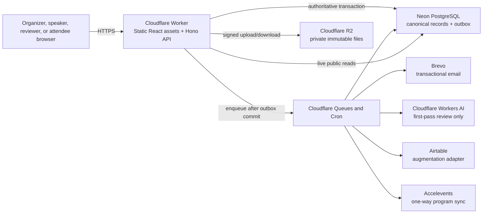
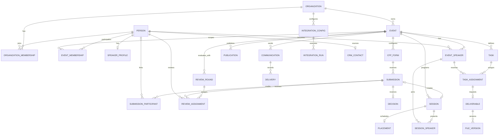

# ProgramFlow V1 Architecture and Build Plan

This document is the build plan for the complete V1 challenge submission. It turns the product and evaluation contract in `Kill My SaaS Research Vault/09 Authoritative Clone Scope.md` into an implementable system. It does not reduce or replace that scope. If the two documents disagree, `09 Authoritative Clone Scope.md` wins.

The user approved this architecture on 2026-08-10 and authorized the corrective amendment recorded below on 2026-08-11. Any later architecture change must update this document before code depends on it.

### Corrective amendment — 2026-08-11

- `Decision` is the sole authority for accepted/rejected outcome; submission status shown in UI is a projection, not a second decision field.
- `Publication` is the sole authority for public go-live state; Scheduling owns placements, revisions, conflicts, and readiness only.
- Slice 0 now includes bounded provider feasibility spikes, and Slice 2 is an early production-real walking skeleton through the complete lifecycle.
- Rubric completion is tracked per item with evidence requirements; area rows are planning rollups only.
- Organizer task, file, resource, publishing, and integration routes are explicitly event-scoped.

## 1. Product outcome

ProgramFlow is a production-grade conference-program operating system that carries canonical data through one connected lifecycle:

`event setup → CFP → draft/submission → review → decision → accepted session and speaker → onboarding and files → schedule → approval → public program → Accelevents`

V1 is complete only when it has:

- every human requirement in the authoritative scope;
- all 84 required evaluator items;
- all 12 Speaker CRM extra-credit items;
- every named competition bonus, including Cloudflare, Airtable augmentation, the usable API, AI first-pass review, populated analytics, performance, embeds, and Forge mirroring when available;
- real persistence, email, uploads, exports, calendar files, synchronization attempts, and inspectable evidence;
- the locked visual direction and conventional discoverable routes;
- a deployed evaluation environment and accessible source repository.

No production feature may be represented by mock data, a decorative toast, an in-memory substitute, or an integration-shaped screen that never contacts the provider.

### Competition delivery contract

| Item | Release obligation |
|---|---|
| Deadline | Submit by Wednesday, August 12, 2026 at 10:00 PM PT. |
| Package | Organizer submission form when supplied, public source repository, deployed evaluation URL, evaluator credentials, setup/evaluation notes, and evidence manifest. |
| Evaluation | The AIE team independently evaluates the deployed product through the stateful scenarios; the app cannot depend on access to a human inbox during browser automation. |
| Human judgment | Product decisions must produce something the team would actually use or buy; visual polish cannot replace missing behavior. |
| Winner follow-up | Keep the deployment, source, and golden-path seed stable for a walkthrough/interview and write-up. |
| Reimbursement record | Preserve valid submission and token/subscription proof needed to request the brief's reimbursement allowance. |

## 2. Architecture at a glance



The application is a **modular monolith**: one repository, one relational database, and one Cloudflare Worker deployment containing independently owned domain modules. Queue consumers and scheduled handlers run from the same codebase. There are no microservices in V1.

## 3. Final technology decisions

| Concern | Decision | Reason |
|---|---|---|
| Language | TypeScript with strict compiler settings | One language across browser, Worker, schemas, tests, and tooling. |
| Web application | React + Vite + React Router | Conventional SPA routes are fast, evaluator-friendly, and match the locked prototype. |
| Client data | TanStack Query for server state; React Hook Form for complex forms | Explicit cache invalidation and reliable dynamic-form behavior without a global state framework. |
| Styling | CSS variables/design tokens plus CSS Modules; no generic visual kit | Ports the locked prototype faithfully without inheriting another product's visual language. |
| Drag and drop | `dnd-kit`, with keyboard/click placement as an accessible equivalent | Real visual scheduling without making drag-and-drop the only control. |
| API runtime | Hono on Cloudflare Workers | Small Worker-native HTTP interface with middleware, typed validation, and static-asset support. |
| Deployment | One Cloudflare Worker with Static Assets, API routes, queue consumer, and cron handlers | Same-origin auth, minimal operations, Cloudflare bonus, and one deployable modular monolith. |
| API style | Versioned REST JSON under `/api/v1`, documented by OpenAPI | Easy for the web client, evaluator, external users, and API bonus. |
| Contracts | Zod schemas shared by client and Worker; database constraints remain authoritative | Consistent validation at the browser and server without trusting the browser. |
| Database | Neon PostgreSQL | Authoritative relational source of truth with a no-spend launch path. |
| Database access | Drizzle ORM and committed SQL migrations through the Neon serverless driver | Typed queries while preserving explicit SQL, constraints, indexes, and transactions. |
| Authentication | Neon Auth for identity/session handling | Real email/password-capable identities; application roles remain in our schema. |
| Authorization | Server-side organization/event memberships plus resource-level predicates | Navigation is never the security boundary. |
| Files | Private Cloudflare R2 bucket; metadata and versions in PostgreSQL | Durable binary storage without database blobs and with inspectable version history. |
| Async work | Transactional PostgreSQL outbox → Cloudflare Queue; Cron republishes stranded outbox work and triggers due reminders | No state transition can commit while silently losing its required side effect. |
| Email | Brevo transactional API | Real delivery and provider message IDs on a free launch allowance. |
| AI review | Cloudflare Workers AI, with score/reasoning persisted separately from human decisions | Claims ABS-14 without making AI authoritative. |
| Scheduling assist | Deterministic in-process greedy placement with conflict checks | Satisfies AIA-08 predictably; advanced OR-Tools remains V2. |
| Observability | Structured Cloudflare logs plus persisted delivery, job, integration, and evidence records | Operational failures and manual-verification side effects remain inspectable. |
| Automated tests | Vitest, real PostgreSQL integration tests, and Playwright | Covers pure rules, durable transactions, role boundaries, and stateful browser scenarios. |
| CI | GitHub Actions | Free, familiar, and sufficient for build/test/deploy gates. |
| Source delivery | GitHub public repository; mirror to Forge if challenge access permits | Meets open-source delivery and attempts the named Forge bonus. |

### Explicit non-decisions

- No Polygres, Supermemory, vector database, graph database, or RAG pipeline in V1. The product data and required search are relational and deterministic.
- No Airtable-as-database. Airtable receives stable canonical IDs and may return only explicitly mapped augmentation fields.
- No separate backend framework, Node server, microservice, event-sourcing platform, Kubernetes cluster, or Redis.
- No OR-Tools service until V1 is complete and V2 genuinely needs a second scheduling implementation.
- No paid platform is required to launch. Free tiers have quotas, so `$0 at launch` is a controlled operating target rather than a promise of unlimited free production usage.

## 4. Non-negotiable invariants

1. PostgreSQL is the canonical source for every product record and state transition.
2. A `Submission` never turns into a `Session`; acceptance transactionally creates and links a distinct `Session`.
3. A person is entered once and linked to organizations, events, roles, submissions, sessions, and CRM history.
4. Every organizer, reviewer, and speaker read/write is authorized again on the server.
5. Reviewer queues contain only explicit assignments; blind rounds hide participant identity; peer reviews stay hidden by default.
6. Public surfaces read the same approved, scheduled canonical records and never maintain five independent content copies.
7. Files are private by default, immutable by version, and downloaded through short-lived authorization-aware URLs.
8. Required side effects begin with an outbox record in the same transaction as the triggering state change.
9. All command handlers are idempotent where retries, imports, queues, or external integrations are possible.
10. Event times are stored as UTC instants with an IANA event timezone; display, conflicts, exports, and `.ics` generation use the event timezone.
11. Production adapters are real. Test adapters are allowed only inside automated tests and cannot be selected by a production deployment.
12. A feature is incomplete until reload persistence, permissions, downstream handoff, and evidence have been tested.

## 5. Domain language

`CONTEXT.md` is the canonical domain glossary for requirements, database naming, module interfaces, routes, and UI copy. This architecture may explain how those concepts are implemented, but it must not redefine them. In particular, `Submission`/`Decision` and `Schedule Revision`/`Publication` are deliberately separate concepts with one authority each.

## 6. Core domain model



### Required state machines

| Record | Allowed V1 lifecycle |
|---|---|
| Submission | `draft → submitted`; submitted content is versioned, and editing eligibility is derived from the CFP window. `under_review`, `accepted`, and `rejected` are read-model labels derived from assignments and the authoritative `Decision`, never stored as competing submission outcomes. |
| Review assignment | `assigned → in_progress → submitted`, or `recused`; a submitted response is immutable except an explicit organizer-approved reopen. |
| Decision | `undecided → accepted/rejected → notified`; changing a final decision is an explicit audited command. |
| Session content | `draft → in_review → approved`; edits after approval return it to `in_review` unless the edited field is explicitly non-public. |
| Event speaker | `invited → onboarding → ready`, with `withdrawn` available; readiness is derived from required task completion. |
| Task assignment | `pending → complete`; `overdue` is derived from due date and completion. |
| Deliverable | `requested → submitted → changes_requested → submitted → approved`; every upload adds a file version. |
| Placement | `unscheduled → placed`; conflicts and schedule readiness are computed facts, not user-editable or publication states. |
| Publication | `draft → live → paused`; live queries include only approved content with valid placements. |
| Delivery | `queued → sending → delivered`, `bounced`, or `failed`; retries retain attempt history. |
| Integration run | `queued → running → succeeded`, `partial`, or `failed`; every item records its external ID or error. |
| CRM enrollment | Open pipeline stage transitions followed by terminal `won` or `lost`; every move appends history. |

## 7. Deep modules and ownership

Routes never write tables directly. Each domain module owns its tables and presents one small application interface. Cross-module work occurs through explicit commands in the same transaction or through persisted outbox events after commit.

| Module | Owns | Interface responsibilities | Downstream handoff / requirement area |
|---|---|---|---|
| Identity & Access | identities, email aliases, sessions, organization/event memberships, role grants | Resolve actor, provision credentials, authorize organization/event/resource action | All role/scoping items, evaluator personas |
| Event Configuration | organizations, events, tracks, formats, rooms, branding | Create/update event; manage track/format/room catalogs | CFP, schedule, public surfaces |
| Forms & Submissions | CFP forms/versions, fields, conditions, routing rules, submissions/versions, participants, answers | Publish form; draft/resume/submit/edit/manual-entry; enforce window, limits, validation, conditions | CFP-01–09, CFP-16, ABS-11 |
| Reviews & Decisions | plans, rounds, scorecards, pools, assignments, responses, recusals, AI assessments, decisions | Configure rounds; distribute; review; aggregate; decide; request notification | CFP-10–14, ABS-01–14 |
| Program | sessions, session speakers, session content versions, approval state | Accept submission transactionally; manually add/edit/restore/approve session; assign speakers | CFP-15, CNT-09, CNT-11, CNT-12 |
| Speaker Operations | speaker profiles/profile versions, event speakers, custom fields, tasks/forms/assignments, resources | Manage roster/import; provision portal; update own profile; assign/complete tasks; edit/restore speaker content; publish safe resources | SPK-01–16, CNT-01, CNT-10, CNT-11 plus portal/wiki human requirements |
| Files & Deliverables | file assets, deliverables, file versions, comments, ZIP/export manifests | Authorize upload/finalize; version; comment; approve; download; aggregate; bulk ZIP | SPK-10, CNT-02–08, CNT-13–14 |
| Scheduling | placements, schedule revisions, computed conflicts and readiness | Place/move/unplace; detect conflicts; list/day/week/track/room views; auto-place; report a publishable revision | AIA-01–06, AIA-08 and named agenda views; hands AIA-07 to Publishing |
| Communications | templates, campaigns, recipients, deliveries, calendar artifacts | Render merge fields; queue targeted/bulk/reminder email; generate `.ics`; ingest provider outcomes | CFP-08/14, ABS-09, SPK-06/13/14/16, CNT-08 |
| Publishing | publication state/settings, widget configurations, attendee itineraries/items | Validate scheduling/content eligibility; perform the sole go-live/pause transition; query one eligible live program; search/filter/details; itinerary; embed/share/export formats | AIA-07 and EMB-01–16 |
| Integrations | encrypted configs, mappings, external links, runs/items | Preview and execute idempotent Accelevents/Airtable sync; retry failed items | Accelevents and Airtable human/bonus requirements |
| Speaker CRM | contact extensions, notes, tags/custom fields, duplicate candidates/merges, segments, pipelines/transitions | Search/filter/import/merge; source through pipeline; push person into event; bulk outreach; metrics | CRM-01–12 |
| Operations & Evidence | outbox, job attempts, activity feed, evidence records, dashboard projections | Dispatch jobs, recover retries, expose work queue/readiness/analytics, assemble evidence bundle | Dashboard, performance, manual release proof |

The deletion test applies: if a proposed module merely renames a Drizzle query or external SDK call, it does not become a module. True external dependencies—Brevo, Workers AI, Airtable, and Accelevents—have injected ports with real production adapters and controlled test adapters. Internal PostgreSQL access stays private to the owning module rather than exposing repositories across the codebase. Scheduling exposes readiness through its module interface; Publishing consumes that interface and owns the only public-state transition, avoiding a coordination layer between duplicate publication flags.

## 8. Transaction and data rules

### PostgreSQL conventions

- Application-generated UUIDv7 primary keys; human-facing slugs are separate and unique within their parent scope.
- `created_at`, `updated_at`, and integer `revision` on mutable aggregate roots.
- Optimistic concurrency for form definitions, content, and schedule edits; stale writes return `409 conflict` with the current revision.
- Foreign keys, check constraints, unique constraints, and partial indexes enforce invariants even if application code is wrong.
- Organization and event IDs are carried on scoped tables and verified in every query path.
- JSONB is permitted for version snapshots, external augmentation, and condition expressions, not as a substitute for core relational entities.
- Search begins with indexed PostgreSQL full-text/trigram search and normalized relational filters.
- Soft deletion is used only where history, provider linkage, or recovery requires it. Otherwise deletion is explicit and foreign-key-safe.

### Atomic acceptance handoff

One database transaction:

1. locks the submitted proposal and verifies organizer scope;
2. creates the accepted `Decision` or confirms the existing accepted decision;
3. finds or creates canonical `Person` and `Event Speaker` links for provisioned participants;
4. creates a distinct `Session` with copied provenance fields and `accepted_submission_id`;
5. creates `Session Speaker` links without re-entry;
6. appends content/version history;
7. inserts outbox events for decision email, portal invitation, tasks, dashboard refresh, and integration eligibility;
8. commits once.

Retrying with the same idempotency key returns the same session and never duplicates speakers or messages.

The accepted/rejected outcome exists only on `Decision`. Organizer and speaker submission lists may display `under_review`, `accepted`, or `rejected`, but those labels are projections derived from review assignments and `Decision`; commands never update a second outcome field on `Submission`.

### Outbox delivery

The command transaction inserts an `outbox_event`. A queue publisher claims rows with `FOR UPDATE SKIP LOCKED`, publishes them, and marks them dispatched. Queue consumers use the event ID as their idempotency key. Exponential retries end in a visible dead-letter state, never silent loss. Cron republishes old undispatched rows and calculates due task/reviewer reminders.

### Files

1. The Worker authorizes an upload and returns a short-lived R2 upload URL.
2. The browser uploads directly to a private quarantine key.
3. Finalization verifies size, declared type, magic bytes, checksum, actor ownership, and task/session scope.
4. A transaction creates the immutable `File Version` and advances the deliverable.
5. Downloads use short-lived signed URLs after authorization. Untrusted documents use attachment disposition; validated images may render inline.
6. Re-upload never overwrites an R2 object. Bulk ZIP contains the latest authorized versions plus a manifest.

### Public consistency

Publication is a gate, not a copied CMS. All five public surfaces call the same `PublishedProgram` query over live event, approved session/speaker content, and current valid placements. Widget configurations add field selection, branding, and filters without copying session data. Public responses use short edge caching with event-revision keys; canonical updates bump the revision and invalidate the old cache. An embed therefore receives current data without being regenerated.

`PublishingModule.publishProgram()` is the sole public go-live command. It asks Scheduling for a specific conflict-free `Schedule Revision`, verifies content eligibility, and advances `Publication` atomically. Agenda UI actions call this command; Scheduling never stores a separate published flag.

## 9. Authentication, roles, and routes

### Authorization matrix

| Role | Can access | Must never access |
|---|---|---|
| Organizer | All records for organizations/events where organizer membership is active | Other organizations unless separately granted |
| Reviewer | Assigned submissions, active round scorecard, own reviews and recusal actions | Organizer navigation/actions, unassigned submissions, participant identity in blind rounds, peer reviews |
| Speaker | Own submissions, linked sessions/profile, tasks, files, resources, decisions | Other speakers' private records, reviews, organizer routes |
| Anonymous attendee | Published public program and itinerary identified by an unguessable anonymous token | Draft/unapproved content, private files, admin/speaker/reviewer data |

Roles are additive: one person may be an organizer in one event and speaker or reviewer in another. Authorization uses the active membership and resource relationship, never a global `user.role` column.

### Discoverable route contract

| Surface | Route family |
|---|---|
| Authentication | `/login`, `/signup`, `/accept-invite` |
| Organizer home | `/organizer`, `/organizer/events/:eventSlug/dashboard` |
| Event setup | `/organizer/events/:eventSlug/settings` |
| CFP builder and preview | `/organizer/events/:eventSlug/cfp`, `/cfp/:eventSlug` |
| Submissions and evaluations | `/organizer/events/:eventSlug/submissions`, `/organizer/events/:eventSlug/evaluations` |
| Speakers, tasks, files | `/organizer/events/:eventSlug/speakers`, `/organizer/events/:eventSlug/tasks`, `/organizer/events/:eventSlug/files` |
| Agenda | `/organizer/events/:eventSlug/agenda` |
| Communications/resources | `/organizer/events/:eventSlug/communications`, `/organizer/events/:eventSlug/resources` |
| Publishing/integrations | `/organizer/events/:eventSlug/publish`, `/organizer/events/:eventSlug/integrations/accelevents`, `/organizer/events/:eventSlug/integrations/airtable` |
| Speaker CRM | `/organizer/speaker-crm` |
| Speaker portal | `/speaker`, `/speaker/events/:eventSlug/*` |
| Reviewer portal | `/reviewer`, `/reviewer/rounds/:roundId` |
| Public sessions | `/events/:eventSlug/sessions` |
| Public speakers | `/events/:eventSlug/speakers` |
| Public agenda | `/events/:eventSlug/agenda` |
| Public itinerary | `/events/:eventSlug/itinerary` |
| Public gallery | `/events/:eventSlug/gallery` |
| Versioned API | `/api/v1/*` and `/api/v1/openapi.json` |

Every protected route has matching server middleware and resource-scoped query predicates. Direct URL access is tested; hidden navigation alone never counts as protection.

## 10. API design

- Resource reads use `GET`; state-changing actions use explicit command endpoints such as `POST /submissions/:id/submit`, `/decide`, `/sessions/:id/approve`, and `/agenda/auto-place`.
- Creates and retryable commands accept `Idempotency-Key`.
- Mutable resource responses contain `revision` and `ETag`; update commands use `If-Match` for conflict detection.
- Errors use one JSON shape: stable code, human message, field issues, correlation ID, and optional current revision.
- List endpoints use cursor pagination, server filters, stable sorting, and bounded page sizes.
- OpenAPI documents organizer-safe and public endpoints with example payloads and authentication requirements.
- The V1 bonus API covers events, submissions, sessions, speakers, schedule, and published program reads plus bounded organizer commands. SessionBoard endpoint parity is not attempted.
- External API clients receive scoped revocable tokens stored as hashes, not reusable organizer session cookies.

## 11. Requirement-critical behavior

### Dynamic CFP forms and category routing

Form definitions are immutable published versions. A draft builder can add short text, long text, dropdown, participant, date, checkbox, and file questions. Conditions are a validated expression tree over known answers. The same pure evaluator runs in the browser for responsiveness and on the server for truth.

Tracks/formats may:

- show or require additional fields;
- select a default reviewer pool for later bulk distribution;
- label the submission for organizer filtering.

Server validation uses the exact published form version attached to the submission. One speaker is always a valid minimum. The close window and edit lock use event-local time converted through the IANA timezone. Drafts count toward limits only when the organizer enables that clearly labeled policy.

New/updated-submission organizer alerts are an optional CFP setting. When enabled, they use the same outbox and delivery records as every other communication rather than an untracked notification shortcut.

### Review isolation and aggregation

- A review assignment is required for every reviewer read/write.
- Blind-round queries omit participant joins entirely.
- Reviewer responses are selected by `reviewer_person_id`; peer values are never serialized before or after submission unless a future explicit reveal policy is added.
- Weighted aggregates normalize criterion weights and exclude unsubmitted/recused responses.
- AI assessment is a separate advisory record containing provider, model, prompt version, numeric score, written reasoning, timestamps, and error state. Human decision and optional override record the organizer and reason.
- CSV export contains raw criterion answers, normalized/weighted aggregate, reviewer status, recusal, and decision.

### Scheduling

- Placement uses `[start, end)` intervals, so back-to-back sessions do not conflict.
- A room overlap is rejected unless the organizer explicitly keeps a visibly conflicted draft; publishing remains blocked.
- Any shared session speaker creates a speaker overlap conflict.
- Day, week, list, track, and room are views over the same placements.
- `Auto-place` deterministically sorts unscheduled sessions by duration and stable ID, then chooses the earliest valid configured slot/room with no speaker or room overlap. It records which sessions could not be placed and why.
- `SchedulingModule.autoPlace()` is the stable interface. V1 keeps the heuristic inside the module. If V2 adds OR-Tools, a real remote solver port is introduced then rather than adding a hypothetical adapter now.

### Email and calendar delivery

- Templates have typed, previewable merge fields and store the rendered subject/body snapshot per recipient.
- Brevo message ID, accepted time, delivered/bounced/failed webhook or polling result, and attempts are stored per delivery.
- Bulk operations expand to recipient rows before queueing, enabling accurate partial outcomes.
- Calendar generation is deterministic RFC 5545: stable UID, UTC timestamps plus event timezone display data, organizer/attendee, sequence, status, and method. Schedule changes increment sequence; cancellation emits a cancellation artifact.
- Speaker session invitations attach `.ics`; attendee itinerary exports combine selected sessions. Tests parse generated files with an independent calendar parser.

### Public widgets and anonymous itinerary

- Sessions search matches session title and speaker name; facets cover track, format, and location.
- Speakers lists and gallery sort by normalized surname and provide graceful fallbacks.
- Agenda and itinerary share placements but have independent required presentation.
- Anonymous itinerary gets a random, unguessable server record ID in a secure same-site cookie and local recovery token. Its selected sessions persist in PostgreSQL across full reloads without requiring attendee registration.
- Embed administration creates stable configurations for styled iframe/script, basic HTML, JSON, XML, and iCal. The script/iframe supports external origins, responsive height messages, configured fields/branding, and live interaction. JSON/XML/iCal serialize the same eligible query.

### Portal resources and embedded HTML

Organizer-authored resources support structured rich content plus HTTPS iframe embeds. On save, the server sanitizes markup, removes scripts/event handlers, allowlists safe tags/attributes, forces iframe sandbox/referrer policy, and optionally limits iframe origins per organization. Raw arbitrary JavaScript is never executed in the speaker portal.

### Integrations

Integration credentials are encrypted with AES-GCM using a versioned Worker secret; only ciphertext and key version enter PostgreSQL. Logs redact tokens and personal payloads.

**Accelevents** is one-way, ProgramFlow → Accelevents. The organizer maps approved sessions, speakers, schedule times, room, track/category, and stable IDs; previews diffs; then starts a real API run. External IDs make retries update rather than duplicate. Missing mappings produce item-level failures. Completion requires a live sandbox/authorized account run and evidence—not a mock response.

**Airtable** is an augmentation adapter. Organizer imports/selects a base/table, maps fields, and syncs canonical people/speakers/sessions outward with `_programflow_id`. Canonical fields are app-wins. Explicit Airtable-owned augmentation columns may sync back only into namespaced `external_attributes`; they cannot overwrite identity, decisions, schedule, or publication. Every direction and conflict is logged.

### Speaker CRM

CRM reuses `Person` and `Speaker Profile`; it does not fork event speakers into a second database. Imports normalize emails/phones and surface likely duplicates. Merge chooses a primary person, moves safe relationships transactionally, retains aliases, and records provenance. Saved segments store filter definitions and evaluate against current records. Pushing a CRM contact to an event creates an idempotent `Event Speaker` link with profile data intact.

## 12. Security and privacy baseline

- Secure, HTTP-only, same-site session cookies; CSRF protection/origin checks on cookie-authenticated mutations.
- Password and session management delegated to Neon Auth; no application password storage.
- Server-side RBAC plus relationship checks for every resource.
- Parameterized queries through Drizzle; no user-composed SQL.
- CSP, output encoding, sanitized resource HTML, no unsafe inline script in application pages.
- Strict CORS: same-origin application by default; only public embed/data endpoints allow configured cross-origin reads.
- Upload size/type limits, magic-byte validation, sanitized filenames, checksums, private R2 keys, and attachment disposition for untrusted files.
- Secrets only in Cloudflare environment secrets; tenant integration credentials encrypted before database storage.
- Rate limits on login, signup, public submission, itinerary mutation, API tokens, and integration triggers, configured so seeded evaluator flows remain usable.
- Logs redact authentication, integration secrets, signed URLs, and email bodies. Required evidence exposes metadata/rendered previews only to authorized organizers.
- Data export and deletion operations preserve records that are legally/operationally required for submission, review, and delivery evidence until an explicit retention policy removes them.
- Dependency and secret scanning run in CI.

## 13. Repository structure

```text
/
├── AGENTS.md
├── architecture.md
├── CONTEXT.md                      # canonical product/domain language
├── apps/
│   ├── web/                         # React SPA, routes, feature workspaces
│   │   └── src/
│   │       ├── app/                 # router, auth shell, query client
│   │       ├── features/            # UI by product module
│   │       └── styles/              # locked tokens and global primitives
│   └── worker/                      # Hono HTTP, queues, cron, static assets
│       └── src/
│           ├── modules/             # deep backend domain modules
│           ├── http/                # route composition and middleware
│           ├── jobs/                # queue/cron entry points
│           └── adapters/            # Brevo, R2, AI, Airtable, Accelevents
├── packages/
│   ├── contracts/                   # Zod DTOs, error and OpenAPI contracts
│   ├── database/                    # Drizzle schema, client, migrations
│   ├── ui/                          # reusable product UI primitives
│   └── testkit/                     # factories, personas, external test adapters
├── tests/
│   ├── integration/                 # real PostgreSQL/module interface tests
│   ├── e2e/                         # 20 stateful evaluator scenarios
│   ├── contracts/                   # adapter and public output contracts
│   └── manual/                      # evidence checklists and validators
├── scripts/
│   ├── seed-evaluation.ts
│   ├── verify-evidence.ts
│   └── verify-migrations.ts
├── docs/
│   ├── requirements/                # machine-readable ID → test/evidence registry
│   ├── evidence/                    # generated release evidence manifests
│   └── runbooks/                    # deploy, restore, provider, and eval guides
└── wrangler.jsonc
```

Backend modules are folders inside the Worker until a genuine reuse/deployment seam exists. Shared packages contain stable cross-tier contracts or reusable primitives, not one package per table.

## 14. Migration and seed strategy

### Migrations

- Drizzle generates reviewed SQL migrations; committed migrations are immutable and forward-only.
- Production never uses schema push or automatic destructive synchronization.
- CI applies all migrations to an empty PostgreSQL 17 database and upgrades a copy of the previous schema.
- Deploy order is expand → deploy compatible code → backfill → enforce/contract in a later migration.
- Large backfills are resumable jobs with checkpoints; schema changes do not depend on a browser request finishing.
- Before a production migration, create a Neon branch/restore point when the plan permits and take an explicit logical backup of critical tables.
- Rollback normally means deploy previous compatible code; destructive data reversal requires a reviewed corrective migration or restore, never `git reset`-style database destruction.

### Seeds and evaluator identities

- Seeds are deterministic, idempotent, environment-gated, and never run implicitly in production.
- The evaluation environment contains `DevFlow Conf 2027`, exact dates/location/tracks/formats, filled public content, and usable organizer, speaker, second speaker, and reviewer credentials.
- Jordan Alvarez, Priya Raman, Sam Whitfield, and fixture CSV/scenario email variants map through `person_email_aliases` to canonical people. Aliases never grant a role; memberships do.
- Password credentials are delivered in submission/evaluator configuration, not displayed publicly in the application.
- Focused Playwright scenarios may reset to a named database snapshot or use a run-scoped organization for diagnosis. The release suite must also execute the evaluator's complete ordered cross-area chain against one run-scoped organization without resetting between areas, so CFP-to-public handoffs cannot be masked by scenario seeds.

## 15. Test and evidence strategy

### Test layers

| Layer | Purpose | Realism |
|---|---|---|
| Pure rule tests | Form conditions, weighted scores, merge fields, interval conflicts, publication eligibility, CRM matching | No I/O; deterministic Vitest |
| Module interface tests | Transactions, constraints, authorization, idempotency, handoffs, outbox | Real PostgreSQL 17 test instance |
| Storage tests | Upload authorization, checksum/type validation, versioning, ZIP manifest | R2-compatible local test storage plus a live R2 smoke test |
| Adapter contract tests | Request mapping, response/error handling, retries, webhook verification | Controlled HTTP adapter tests plus provider sandbox/live smoke tests |
| API tests | Auth middleware, DTO validation, errors, ETags, pagination, OpenAPI | In-process Hono with real test database |
| Browser E2E | Exact organizer/speaker/reviewer/anonymous stateful jobs | Playwright against a deployed-equivalent Worker build |
| Manual proof | Real email, `.ics`, downloads, external-origin embeds, integration runs | Evaluation environment with retained artifacts/logs |
| Quality gates | Accessibility, performance, responsive layouts, security headers | axe, Lighthouse, browser/device matrix, header tests |

Production adapters are never replaced in the evaluation deployment. Automated tests may inject deterministic adapters because the adapter seam is the test surface; release smoke/manual checks prove the real provider.

### Automated rubric coverage

| Scenario group | IDs covered | Primary automated proof |
|---|---|---|
| CFP-S1 | CFP-01, CFP-02, CFP-03, CFP-04 | Builder → anonymous published form → closed state Playwright chain |
| CFP-S2 | CFP-05, CFP-06, CFP-07, CFP-08, CFP-09, CFP-16 | Speaker draft/submit/edit plus organizer round-trip and delivery evidence |
| CFP-S3/S4 | CFP-10, CFP-11, CFP-12, CFP-13, CFP-14, CFP-15 | Cross-role reviewer/organizer/speaker chain and accepted-session transaction |
| ABS-S1 | ABS-11 | Co-author submission and organizer results assertions |
| ABS-S2 | ABS-01, ABS-02, ABS-03, ABS-04, ABS-05, ABS-06, ABS-08, ABS-09 | Round/pool/scorecard/assignment/progress/reminder E2E |
| ABS-S3 | ABS-07, ABS-10, ABS-12, ABS-13, ABS-14 | Blind isolation with second reviewer, aggregates, recusal, export, real AI assessment/override |
| SPK-S1 | SPK-01, SPK-02, SPK-03, SPK-04, SPK-05, SPK-06 | Roster/add/import/status/task/invite E2E |
| SPK-S2 | SPK-07, SPK-08, SPK-09, SPK-10, SPK-11 | Speaker-only portal round-trip, profile/file/task/session |
| SPK-S3 | SPK-12, SPK-13, SPK-14, SPK-15, SPK-16 | Progress/filter/bulk personalized mail/logistics/reminders |
| CNT-S1/S2 | CNT-01, CNT-02, CNT-03, CNT-04, CNT-05, CNT-06 | File request, scoped upload, re-upload/version/comment chain |
| CNT-S3 | CNT-07, CNT-08, CNT-09, CNT-10, CNT-11, CNT-12, CNT-13, CNT-14 | Dashboard/reminder/edit/history/restore/approval/library/ZIP chain |
| AIA-S1 | AIA-01, AIA-02, AIA-03, AIA-04, AIA-05, AIA-06 | Multi-day placement, reload, two conflict types, move-and-clear |
| AIA-S2 | AIA-07, AIA-08 | Deterministic auto-place and live public handoff |
| EMB-S1 | EMB-01, EMB-02, EMB-03, EMB-04, EMB-05, EMB-06, EMB-07, EMB-08, EMB-09, EMB-12, EMB-13, EMB-14 | Logged-out tour of all public browse/detail/search/filter/day surfaces |
| EMB-S2 | EMB-10, EMB-11 | Server-persisted anonymous itinerary reload and parsed calendar export |
| EMB-S3 | EMB-15, EMB-16 | Embed config plus external-origin harness and cross-surface canonical consistency |
| CRM-S1 | CRM-01, CRM-02, CRM-03, CRM-04, CRM-05, CRM-06 | Organization directory/filter/profile/import/duplicate/merge chain |
| CRM-S2 | CRM-07, CRM-08, CRM-09, CRM-10, CRM-11, CRM-12 | Pipeline/history/segment/event handoff/bulk email/analytics chain |

### Human and bonus coverage

| Contract not fully expressed by rubric IDs | Planned proof |
|---|---|
| Event configuration and branding | Organizer E2E plus public CFP/program round-trip |
| Abstract-vs-session form target and manual entry | Builder/manual-entry E2E and database provenance assertion |
| Welcome/instruction/success copy, participant limits, submission limits, draft reminders | CFP settings E2E and rendered email evidence |
| Portal resource/wiki with HTML embed | Sanitization tests plus authorized speaker rendering of allowlisted external iframe |
| Speaker calendar delivery | Real Brevo delivery record and independently parsed attached `.ics` |
| Agenda list/day/week/track/room views | One placement asserted across every named view |
| Outstanding onboarding dashboard | Seeded incomplete tasks, real-time counts, filtered reminder action |
| Native Accelevents handoff | Real mapped run, external IDs, item log, retry of a controlled failure |
| Cloudflare bonus | Public deployed Worker URL and deployment record |
| Airtable bonus | Real base/table mapping and outward plus allowlisted augmentation sync evidence |
| API bonus | OpenAPI document and authenticated/public API smoke collection |
| Dashboard analytics | Populated work queue, readiness metrics, and CRM analytics tied to SQL definitions |
| Performance bonus | Recorded Lighthouse/API/database-query budgets on filled fixture data |
| Forge bonus | Repository mirror/hosting URL when access is available |
| Open-source/deployed delivery | Public source URL, deployment URL, setup/runbook, license |

### Manual evidence bundle

Release produces a dated manifest linking:

- provider delivery IDs and rendered previews for confirmation, decisions, invites, reviewer/speaker reminders, and bulk sends;
- independently parsed speaker and attendee `.ics` files;
- review and CSV exports with expected row/column assertions;
- uploaded headshot/slides, immutable version history, comments, restored content, and ZIP manifest;
- two-person reviewer isolation and two-speaker portal isolation recordings/screenshots;
- external-origin interactive widget page plus JSON, XML, and iCal validators;
- Accelevents and Airtable run/item logs with redacted provider response metadata;
- reload persistence and canonical consistency reports;
- CI commit SHA, migration version, deployment ID, and requirement coverage summary.

## 16. Deployment environments and zero-spend controls

| Environment | Purpose | Data/provider policy |
|---|---|---|
| Local | Development and fast rule/module tests | Local web/Worker; isolated PostgreSQL test DB; provider test adapters only in test process |
| Preview | Pull-request browser and migration smoke | Separate Neon branch/schema and R2 prefix; external sends disabled unless an explicit live-smoke job is invoked |
| Evaluation | Judge-ready production-equivalent app | Stable seeded data, real auth/storage/email/AI/integrations, evaluator credentials, retained evidence |
| Production | Final public deployment | Separate secrets/data/buckets; no automatic seeds; same artifact promoted from evaluation |

Launch services stay within free allowances: Cloudflare Worker/Static Assets/Queues/Cron/R2/Workers AI, Neon, Brevo, GitHub Actions, and Airtable where used. Controls:

- no automatic paid upgrade or usage top-up;
- provider budgets/quotas monitored on the operations screen;
- queue backpressure and per-operation caps prevent runaway email/AI/integration usage;
- public cache and direct browser-to-R2 uploads reduce Worker/database consumption;
- use `workers.dev` until an already-owned custom domain is available;
- exceeding a free limit fails visibly and safely rather than creating an unapproved bill.

## 17. Observability and performance

### Observability

- Every HTTP request receives a correlation ID propagated to outbox, queue, delivery, AI, and integration attempts.
- Structured logs include environment, module, actor/person ID, organization/event ID, operation, duration, result code, and correlation ID; no secrets or bodies.
- User-visible activity records cover requirement-relevant changes: decisions, reviews, content versions/restores, file actions, placements, sends, and syncs.
- Operations UI exposes stuck outbox rows, job retries, delivery failures, integration partials, and recent deployments.
- Health/readiness endpoints verify Worker, database, migrations, queue configuration, R2 access, and required provider configuration without leaking secrets.

### Performance budgets

- Public pages: mobile LCP under 2.5 seconds at the 75th percentile on the filled evaluation dataset; no auth dependency.
- Warm API reads: p95 under 300 ms; writes under 600 ms excluding async provider completion.
- Initial organizer JavaScript budget: 250 KB gzip target; route-level lazy loading for scheduler, form builder, and CRM.
- Public endpoints use indexed eligibility queries, cursor pagination, selected columns, and event-revision edge cache.
- No N+1 queries on lists. CI query-count tests cover submissions, speakers, agenda, and public surfaces.
- Large CSV/ZIP operations stream or run asynchronously and expose progress instead of holding a browser request open.

## 18. Vertical-slice build order

Each slice must be merged only after its real database transition, role boundary, downstream handoff, and evidence pass. A slice may establish UI needed by later work but cannot claim later requirements early.

### Slice 0 — Foundation, deployable skeleton, and provider feasibility gates

- **Scope:** workspace, strict TypeScript, React/Hono, design tokens, database/migrations, Neon Auth, role middleware, R2 bindings, outbox/queue, structured logs, CI, preview/evaluation deploy; bounded feasibility harnesses for every release-critical external dependency.
- **Roles:** organizer, speaker, reviewer, anonymous route shells.
- **Persisted transition:** create organization, event, people, memberships, aliases, provider configuration.
- **Handoff:** every later slice uses the same identity, transaction, job, evidence, and deployment foundation.
- **Provider gates:** prove seeded/password evaluator identities can be provisioned; a transactional outbox row can be claimed and delivered through Queue; a signed R2 upload/finalize/download round trip works; Brevo accepts a send and reports an outcome; Workers AI returns the required result shape; Airtable can round-trip a namespaced augmentation field; and current Accelevents documentation, credentials, writable objects, and stable-ID update semantics are available. A missing external credential becomes an explicit `blocked_external` record before dependent feature work, not a surprise in Slice 12.
- **Proof:** migration-from-empty, four-role access matrix, static/protected/public route smoke, deployed health check, and dated provider-feasibility records. Harnesses may use isolated test accounts but cannot claim a rubric item or remain as parallel production implementations.

### Slice 1 — Event setup and evaluator seed

- **Requirements:** human event configuration, branding, fixture compatibility.
- **Roles:** organizer; anonymous branding consumer.
- **Persisted transition:** organization/event/tracks/formats/rooms/branding created and edited.
- **Handoff:** catalogs drive CFP, review routing, schedule, public program, integrations.
- **Proof:** reload, timezone/date validation, exact DevFlow fixture seed, public branding round-trip.

### Slice 2 — Production-real golden-path walking skeleton

- **IDs completed by the narrow path:** CFP-03, CFP-05, CFP-06, CFP-10, CFP-11, CFP-12, CFP-13, CFP-15, CNT-12, AIA-03, AIA-07, EMB-01. Later slices deepen and regression-test these behaviors; they do not introduce alternative paths.
- **Human requirement advanced but not yet verified:** HUM-01 program-side lifecycle.
- **Roles:** organizer → speaker → reviewer → organizer → speaker → anonymous attendee.
- **Persisted transition:** configured event/minimal CFP → submitted proposal → explicit review assignment and response → authoritative decision → distinct linked session/event speaker → approved content → placement → `Publication` live → public session card.
- **Handoff:** crosses the real database and the external seams already proven in Slice 0, establishing one narrow interface through every core module before feature depth is added.
- **Proof:** one serial Playwright test with role changes and reloads, module-interface tests for acceptance/idempotency/authorization, and a final logged-out public read from the same canonical record. No mock, static seed substitution, or reset is allowed inside this chain.

### Slice 3 — Complete CFP builder, drafts, submissions, and confirmation

- **IDs:** CFP-01, CFP-02, CFP-04, CFP-07, CFP-08, CFP-09, CFP-16, ABS-11; regression coverage for CFP-03, CFP-05, and CFP-06 from Slice 2.
- **Human additions:** abstract/session target, welcome/instructions/success copy, participant labels/min/max, close window, submission limits, multiple drafts, draft reminders, manual entry, and category routing.
- **Roles:** speaker → organizer.
- **Persisted transition:** draft form → immutable published version; account/person → draft → submitted/versioned → edited while open; co-author links retained; closed form blocks creation and editing.
- **Handoff:** organizer inbox and review eligibility; published form version remains server validation/routing authority; confirmation outbox → real Brevo delivery.
- **Proof:** builder/public/closed chain, server/client condition parity, stateful cross-role E2E, reload/resume, after-close denial, and email evidence.

### Slice 4 — Review plans, assignment, isolated scoring, AI advice, and exports

- **IDs:** ABS-01 through ABS-14; regression coverage for CFP-10 and CFP-11 from Slice 2.
- **Roles:** organizer, reviewer, second reviewer.
- **Persisted transition:** plan/round/scorecard/pool → assignments → response/recusal → weighted results; AI assessment → human override.
- **Handoff:** aggregate results feed decisions; reminders feed Communications.
- **Proof:** exact-assignment and blind-review SQL/API/browser tests, peer-isolation manual proof, real AI output, CSV parser assertion.

### Slice 5 — Decisions and accepted-program handoff

- **IDs:** CFP-14 plus hardening/regression coverage for CFP-12, CFP-13, and CFP-15 from Slice 2.
- **Roles:** organizer → speaker.
- **Persisted transition:** no decision exists → accepted/rejected `Decision`; accepted transaction creates linked session/event speakers; notification queued/delivered. Submission-list outcome labels are derived from `Decision` and are never written separately.
- **Handoff:** Program, Speaker Operations, Communications, Scheduling, and integrations receive canonical links.
- **Proof:** idempotent acceptance integration test, cross-role status E2E, real accept/reject delivery evidence.

### Slice 6 — Speaker roster, portal, tasks, profiles, and resources

- **IDs:** SPK-01 through SPK-09, SPK-11, SPK-12, SPK-15.
- **Human additions:** task forms, submission/acceptance state, portal wiki/resources and safe HTML embeds.
- **Roles:** organizer ↔ speaker and second speaker.
- **Persisted transition:** speaker add/import/status/invite → assigned task → profile update/task completion/resource view.
- **Handoff:** public speaker data, dashboard readiness, deliverable requests, communications/calendar.
- **Proof:** CSV import, two-speaker isolation, organizer round-trip, resource sanitizer/embed harness.

### Slice 7 — Files, deliverables, versions, approvals, and content history

- **IDs:** SPK-10; CNT-01 through CNT-07; CNT-09 through CNT-14.
- **Roles:** organizer ↔ speaker.
- **Persisted transition:** file request → upload v1/v2 → comment → changes/approval; session/speaker edit → history → restore; bulk ZIP manifest.
- **Handoff:** readiness dashboard, reminders, public approval gate, Accelevents eligibility.
- **Proof:** real R2 upload/download, cross-role comments, immutable versions, restore, private access denial, parsed ZIP.

### Slice 8 — Communications, reminders, and calendar

- **IDs:** ABS-09; SPK-06, SPK-13, SPK-14, SPK-16; CNT-08; completes CFP-08/14 evidence.
- **Roles:** organizer → reviewers/speakers.
- **Persisted transition:** template/campaign → recipients → deliveries/attempts/outcomes; scheduled task/review reminder → delivery; session placement → versioned calendar artifact.
- **Handoff:** dashboards show success/failure and retry actions.
- **Proof:** real provider IDs, personalized snapshots, bounce/failure handling, independently parsed `.ics` attachments.

### Slice 9 — Agenda, conflicts, auto-place, and publication gate

- **IDs:** AIA-01 through AIA-08.
- **Human additions:** list, day, week, track, and room views.
- **Roles:** organizer.
- **Persisted transition:** unscheduled session → placed/moved in a `Schedule Revision`; conflicts appear/clear; auto-place result; Publishing advances the sole `Publication` from draft to live for an eligible revision.
- **Handoff:** Scheduling reports readiness; Publishing owns go-live; calendar delivery reads the selected live revision's current placements.
- **Proof:** reload persistence, room/speaker overlap tests, keyboard/click and drag placement, one-action assist, all five views.

### Slice 10 — Public program, itinerary, and embeds

- **IDs:** EMB-01 through EMB-16.
- **Roles:** anonymous attendee; organizer embed administrator.
- **Persisted transition:** existing live `Publication` gains complete widget/configuration behavior; anonymous itinerary selections persist; embed configuration versions persist. No second go-live state is introduced.
- **Handoff:** website embeds and exports read the same canonical program.
- **Proof:** all five logged-out surfaces, search/filter/detail/day behavior, reload itinerary, calendar parser, external-origin interactive embed, JSON/XML/iCal validation, consistency report.

### Slice 11 — Operations dashboard and complete work queue

- **Requirements:** outstanding onboarding dashboard, populated general analytics, recent activity, readiness, usable product judgment.
- **Roles:** organizer.
- **Persisted transition:** none invented; projections derive from actual incomplete reviews/tasks/files/conflicts/publication/integration failures.
- **Handoff:** every action deep-links to the responsible workspace, matching the locked prototype.
- **Proof:** SQL metric-definition tests and filled-state Playwright navigation.

### Slice 12 — Accelevents and Airtable

- **Requirements:** native one-way Accelevents human requirement; Airtable bonus.
- **Roles:** organizer.
- **Persisted transition:** encrypted config/mapping → preview → queued run → item outcomes/external links → retry; allowed Airtable augmentation import.
- **Handoff:** approved program and canonical people are synchronized without re-entry.
- **Proof:** real authorized provider runs, idempotent retry, missing-mapping partial failure, redacted evidence logs.

### Slice 13 — Speaker CRM extra credit

- **IDs:** CRM-01 through CRM-12.
- **Roles:** organization organizer.
- **Persisted transition:** contact/import → notes/tags/custom fields → duplicate merge → saved segment → pipeline/history → event speaker handoff → outreach.
- **Handoff:** existing Speaker Operations and Communications modules, no duplicate person data.
- **Proof:** both CRM scenarios, merge relationship assertions, segment reevaluation, event round-trip, real bulk email log, populated analytics.

### Slice 14 — Public API and source/deployment bonuses

- **Requirements:** usable API, Cloudflare deployment, open-source repository, Forge mirror if available.
- **Roles:** scoped API client and anonymous reader.
- **Persisted transition:** API token issue/revoke; no alternative write model.
- **Handoff:** API commands call the same domain module interfaces as the UI.
- **Proof:** OpenAPI validation, token-scope tests, API smoke collection, public repo/deployment/mirror links.

### Slice 15 — Hardening and release evidence

- **Requirements:** all human, 84 required, 12 CRM, bonuses, manual verification, performance, accessibility, security, deployment package.
- **Roles:** all four.
- **Persisted transition:** full golden path on a fresh evaluation seed.
- **Handoff:** final deployed environment and evidence bundle.
- **Proof:** 20-scenario serial run, live provider smoke tests, migration/restore rehearsal, manual evidence manifest, Lighthouse/axe/security budgets, source/deployment submission checklist.

### Execution across agent threads

## 19. Definition of done

A task is done only when its implementation record states:

1. human requirement and/or rubric IDs;
2. roles and authorization rules;
3. starting and resulting persisted state;
4. downstream module/public/integration handoff;
5. idempotency and failure behavior;
6. automated test at the module interface and relevant browser scenario;
7. manual evidence where a browser cannot prove the outcome;
8. locked-design route/workspace affected;
9. migration, observability, accessibility, and performance impact.

The implementation record must update every claimed ID in `docs/requirements/v1-ledger.json` independently. An area's planning row cannot be marked complete and cannot stand in for per-item status or evidence. `implemented` requires a linked implementation record and automated evidence; `verified` additionally requires every applicable manual gate to be verified.

The V1 release gate additionally requires:

- all required and CRM IDs mapped to passing evidence;
- human-only requirements demonstrated;
- no production mock/fake/in-memory adapter paths;
- all five public surfaces consistent and anonymous;
- real email, file, calendar, embed, Accelevents, and Airtable evidence;
- role and reviewer isolation proven with multiple identities;
- fresh-database migrations and deterministic evaluation seed passing;
- deployed Cloudflare URL, public source, setup/evaluation runbook, and Forge mirror when available;
- no V2 feature displacing incomplete V1 work.

## 20. Known external dependencies and failure policy

These do not change the architecture, but Slice 0 must resolve their feasibility or record an explicit external blocker before dependent feature implementation begins. A feasibility pass proves access and protocol shape; it does not satisfy the later feature or live-evidence gate.

| Dependency | Needed from outside the codebase | Failure policy |
|---|---|---|
| Brevo | Verified sender and API key | Queue remains retryable; UI shows configuration/failure; no fake delivery claim. |
| Accelevents | Current API documentation plus authorized sandbox/account credentials | Build real adapter and mapping; release remains incomplete without a live authorized proof. |
| Airtable | Personal access token and test base/table | Bonus remains incomplete without real sync evidence; canonical app continues normally. |
| Workers AI | Enabled Cloudflare account/binding | AI assessment fails visibly; human review remains functional; ABS-14 cannot be claimed until real proof passes. |
| Forge | Repository/hosting access if the platform is available to the entrant | Record attempted availability; mirror when possible without blocking core deployment. |
| Free-tier quotas | Provider accounts within their current allowances | Hard caps and visible failure; never auto-upgrade or create unapproved spend. |

## 21. Approval decision

**Status: approved by the user on 2026-08-10; corrective amendment authorized on 2026-08-11.** Wave 0 control-plane work may proceed; feature behavior remains governed by the amended vertical-slice gates and per-item evidence rules above.

Approving this document approves the following pre-coding gate as one package:

- modular-monolith architecture and exact infrastructure stack;
- relational domain model and canonical-data rules;
- repository structure and deep module ownership;
- migration/seed strategy;
- automated/manual test and evidence strategy;
- zero-spend launch controls;
- the 16-slice build order above.

After approval, implementation begins with Slice 0. Any contradiction discovered during implementation is resolved first against `09 Authoritative Clone Scope.md`, then recorded here before the build continues.
