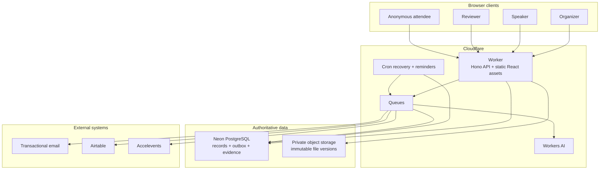
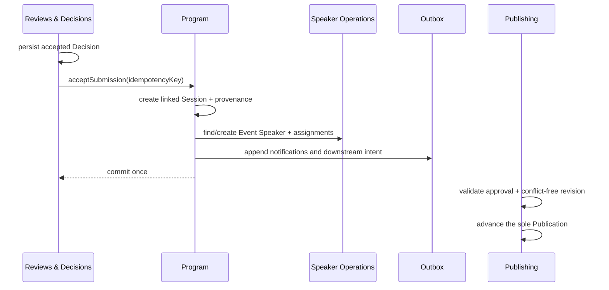

# ProgramFlow system architecture

## 1. Design drivers

ProgramFlow is optimized for correctness across a long, stateful workflow rather than for isolated CRUD screens. The architecture prioritizes:

1. one canonical record for each business concept;
2. explicit cross-module handoffs with provenance;
3. server-enforced role and resource isolation;
4. durable, inspectable side effects;
5. public consistency across multiple presentation formats;
6. deterministic evaluation and recovery;
7. a small operational footprint that can still evolve by module.

## 2. Runtime topology

The Worker is a modular monolith. It serves the React application and versioned REST API, runs queue consumers and scheduled handlers, and composes domain modules. PostgreSQL remains the transaction boundary. External providers are accessed behind ports with production adapters and controlled test adapters.

## 3. Module ownership

Routes validate transport concerns and resolve the actor; they do not write tables directly. Each domain module owns its persistence and exposes a small application interface.

| Module | Owns | Important consumers |
|---|---|---|
| Identity & Access | identities, aliases, sessions, memberships, grants | every protected module |
| Event Configuration | organizations, events, tracks, formats, rooms, branding | forms, scheduling, publishing |
| Forms & Submissions | CFP versions, fields, rules, drafts, submissions, participants, answers | reviews, decisions |
| Reviews & Decisions | rounds, scorecards, pools, assignments, responses, AI assessments, decisions | program, communications |
| Program | sessions, session speakers, content versions, approval state | scheduling, publishing, integrations |
| Speaker Operations | profiles, event speakers, tasks, resources, portal behavior | files, communications, public program |
| Files & Deliverables | assets, deliverables, immutable versions, comments, exports | speaker portal, organizer operations |
| Scheduling | placements, revisions, conflicts, readiness, auto-place | publishing, calendar delivery |
| Communications | templates, campaigns, recipients, deliveries, calendar artifacts | every lifecycle trigger |
| Publishing | publication state, widget configs, eligible program query, itineraries | all anonymous/public surfaces |
| Integrations | encrypted configs, mappings, runs, items, external links | Airtable and Accelevents |
| Speaker CRM | organization contacts, metadata, duplicates, segments, pipeline | speaker operations, communications |
| Operations & Evidence | outbox attempts, evidence records, work/readiness projections | evaluator and operator surfaces |

## 4. State authority

Two separations prevent the most expensive classes of workflow drift.

### Decision is not submission status

`Decision` is the only accepted/rejected authority. Submission lists may project labels such as `under_review`, `accepted`, or `rejected`, but commands never update a second outcome field. Releasing a decision is explicit and audited.

### Publication is not schedule status

Scheduling owns placements, revisions, conflicts, and readiness. Publishing selects one eligible conflict-free revision and is the only module allowed to move `Publication` through `draft → live → paused`.

## 5. Transaction boundaries and idempotency

Commands that may be retried accept an idempotency key. The acceptance handoff locks the submission, confirms the decision, creates canonical people/event-speaker links, creates one distinct session, links speakers, appends content history, and inserts outbox events in one transaction. Repeating the command returns the same result.

External APIs are never part of the database transaction. The business change commits with an `outbox_event`; queue consumers use the event ID as their idempotency key and record every attempt and provider outcome. Cron republishes stranded rows and schedules due reminders. Failures remain visible instead of becoming a successful-looking toast.

## 6. Authorization model

Authorization combines membership with resource relationships:

- organizer operations require an active grant for the organization/event;
- reviewer reads and writes require an assignment for the same person, submission, and round;
- blind rounds omit identity joins instead of hiding fields after serialization;
- speaker operations require ownership through the event-speaker relationship;
- public queries begin from the live publication eligibility predicate.

Every protected route is tested through direct URL/API access. Navigation is a usability layer, never the security boundary.

## 7. Files and deliverables

Files are private and immutable by version:

1. authorize a scoped upload;
2. upload to a private quarantine key;
3. verify size, type, checksum, ownership, and task/session scope;
4. create a new `FileVersion` and advance the deliverable transactionally;
5. issue short-lived authorization-aware download access.

Re-upload never overwrites an object. Bulk export selects the latest authorized versions and emits a manifest.

## 8. Public-program consistency

The sessions list, speakers list, agenda, itinerary, and gallery all call one `PublishedProgram` query. Widget configuration controls branding, fields, and filters without copying session data. JSON, XML, iCalendar, styled embed, and basic HTML serialize the same eligible model.

Eligibility requires a live `Publication`, approved content, and a valid placement. Canonical updates advance the event revision so caches cannot keep an older independent copy alive.

## 9. Failure model

| Failure | System response |
|---|---|
| Stale form/content/schedule edit | Reject with a conflict and current revision; never last-write-wins silently. |
| Duplicate command or queue delivery | Return the existing result using its idempotency key. |
| Provider timeout/failure | Persist the attempt and error, retry within policy, expose the outcome to operators. |
| Missing integration mapping | Produce a partial run with item-level failures; do not fabricate external IDs. |
| Conflicted schedule | Keep the draft visible, block publication, and explain the conflict. |
| Unauthorized direct request | Deny at middleware/module query level even if a route is guessed. |
| Evaluation seed on progressed state | Refuse to repair it; require a controlled reset of the isolated scope. |

## 10. Quality and release strategy

CI starts PostgreSQL 17, applies migrations from empty, seeds the evaluator state twice to prove determinism, and runs the complete quality gate. The current gate contains 74 test files and 247 tests spanning pure rules, database-backed module integration, role isolation, API behavior, UX regressions, performance constraints, build output, and Cloudflare deployment dry-runs.

Release evidence is data, not prose: provider receipts, file/calendar artifacts, integration items, scenario evidence records, the migration version, source SHA, and deployment ID are assembled into an organizer-authorized manifest.

## 11. Deliberate trade-offs

- **Modular monolith over microservices:** lifecycle consistency and low operational overhead matter more than independent deployments at this scale.
- **Relational model over generic document storage:** the product's value is in durable relationships, uniqueness, and authorization predicates.
- **Deterministic scheduling assist over an external solver:** one-action placement is reliable and testable; a solver can later replace the implementation behind the module interface.
- **Outbox over direct provider calls:** slightly more machinery buys durable intent, retries, and evidence.
- **One public query over per-widget materialization:** consistency is more valuable than independent widget write paths.
